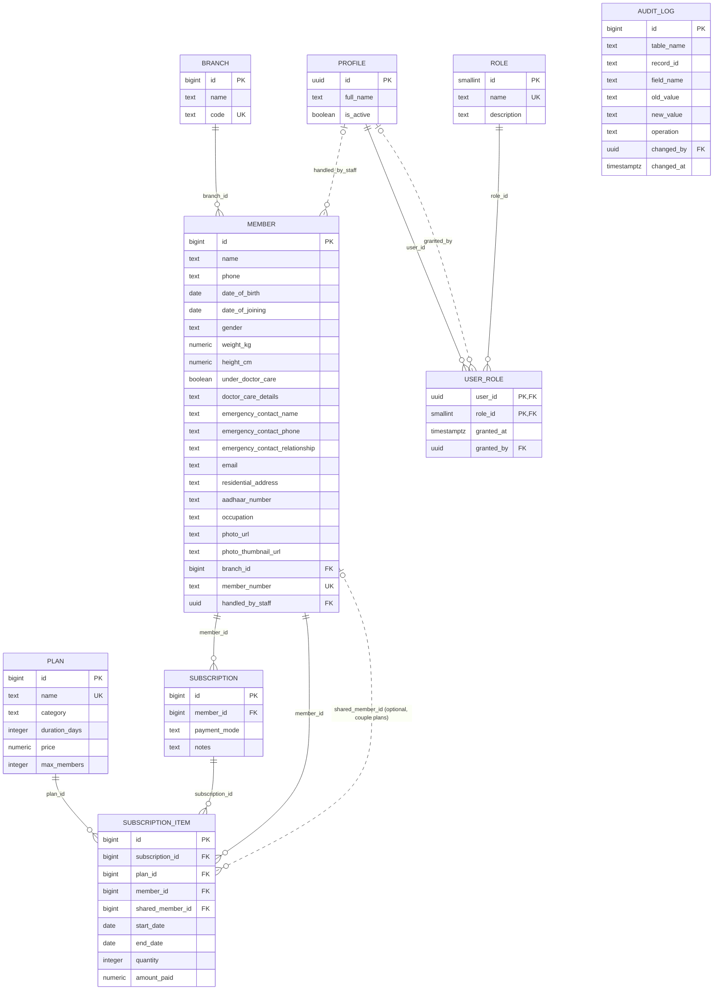

# Domain Model

> Generated from [requirements-template.md](../requirements-template.md) — this is the single source of truth for the domain model. [database.md](./database.md) (SQL schema) and [edge-functions.md](./edge-functions.md) (API/validation layer) are generated from this file; [business-logic.md](./business-logic.md), [rules.md](./rules.md), and [supabase-architecture.md](./supabase-architecture.md) are written to match it.
>
> One open item from requirements-template.md is **not** a data-model question and doesn't block this doc: whether Subscriptions need a dedicated global overview screen (REQ-ADMIN-001, §13 Open Questions). Everything else referenced below is resolved.
>
> **Cancellation/refund and overlap-warning logic are deferred** (see §Open items). This revision replaces the old `Plan`+`AddOn` catalog split and `Subscription`+`SubscriptionAddOn` split with a unified catalog (`Plan`) and a header/line-item split (`Subscription`/`SubscriptionItem`) — see §Open items for what's intentionally not modeled yet.

---

## Audit Fields (common to all tables below, except AuditLog itself)

Every entity carries these four columns, not repeated per table:

| Field      | Type        | Nullable | Default | Constraints                                            |
|------------|-------------|----------|---------|-----------------------------------------------------------|
| created_at | timestamptz | No       | `now()` | Set on INSERT by trigger, never changed                 |
| created_by | uuid        | Yes      | NULL    | FK → `profiles.id`, set on INSERT by trigger             |
| changed_at | timestamptz | Yes      | NULL    | Set on every UPDATE by trigger                           |
| changed_by | uuid        | Yes      | NULL    | FK → `profiles.id`, set on every UPDATE by trigger        |

Never client-settable — see [database.md](./database.md)'s `set_audit_fields()` trigger. Every entity except AuditLog, `configuration`, `member_number_sequences`, and UserRole also carries `deleted_at`/`deleted_by` (soft-delete columns) — see [database.md §Soft-Delete Fields](./database.md#soft-delete-fields-common-to-every-business-table-below). UserRole also doesn't carry `created_at`/`changed_at` in this shared shape — see §1b, it has its own `granted_at`/`granted_by` instead.

---

## 1. Profile

One row per Supabase Auth user (`auth.users`), linked 1:1. Reachable via either email/password or a linked Google OAuth identity, or a password set via the password-reset flow (REQ-AUTH-001–005) — all Supabase Auth-level concepts, not separate columns here.

| Field      | Type    | Nullable | Default   | Constraints                     |
|------------|---------|----------|-----------|----------------------------------|
| id         | uuid    | No       | —         | PK, same value as `auth.users.id`|
| full_name  | text    | No       | —         |                                   |
| is_active  | boolean | No       | `true`    |                                   |

**Triggers**
- `trg_handle_new_auth_user` (`AFTER INSERT` on `auth.users`, not on `profiles` itself) — `handle_new_auth_user()` creates the matching `profiles` row automatically whenever a new Auth user appears (invite or bootstrap); attributes `created_by` to the inviting admin via a per-transaction `set_config` trick, since this runs under the invite flow's own connection, not the inviting admin's session.
- `trg_profiles_audit` (`BEFORE INSERT OR UPDATE`) — `set_audit_fields()`: stamps `created_at`/`created_by` on insert, `changed_at`/`changed_by` on every update. Does **not** touch `deleted_at`/`deleted_by`.
- `trg_profiles_no_hard_delete` (`BEFORE DELETE`) — `prevent_hard_delete()`: unconditionally rejects any real `DELETE`.
- `trg_profiles_audit_fields` (`AFTER INSERT OR UPDATE`) — `audit_row_changes()`: writes one `AuditLog` row per changed field.

**Indexes**: PK on `id`, plus `created_by`/`changed_by`/`deleted_by` (`20260724000000_profiles_fk_indexes.sql`) — the missing-FK-index finding in domain-model-review.md is closed, here and on every other table it named.

**RLS (select)**: `profiles_select_active_users` (any active, non-deleted caller can read any non-deleted profile) plus `profiles_select_self` — a user can always read their **own** row even while deactivated (`auth.uid() = id and deleted_at is null`, no `is_active_user()` gate). Without this second policy, a deactivated caller would fail `is_active_user()` and get zero rows back, indistinguishable from "never invited" — the app needs to tell those two cases apart (REQ-AUTH-003's message vs. the deactivation message), so the self-lookup can't itself depend on being active. Still excludes soft-deleted rows, consistent with every other soft-delete policy. (This policy previously went undocumented in both this doc and auth.md, despite being live since the initial profiles/auth migration.)

**Delete protection**: `id`'s FK to `auth.users(id)` carries no `ON DELETE CASCADE` (the one FK in the schema that used to be an exception — now closed), so a Supabase Auth `admin.deleteUser()` call fails with a foreign-key violation instead of cascading into a real row delete here. Combined with `trg_profiles_no_hard_delete`, a real `DELETE` is unreachable through any path — soft-delete via `soft_delete_profile()` (below) is the only way a Profile is ever removed.

**Validation / write restrictions**: `full_name` required; `is_active` boolean, defaults `true`. Direct client `UPDATE` is restricted at the column-privilege level — `revoke update on profiles from authenticated; grant update (full_name) on profiles to authenticated` — so `is_active`/`deleted_at` cannot be touched by a direct `supabase-js` call regardless of RLS policy, only through the RPCs below. `role` was removed as a column entirely (§1a/§1b).

**Deletion (REQ-ADMIN-006)**: admin can soft-delete a user account — separate from, and independent of, the `is_active` toggle above — via the `soft_delete_profile(p_caller_id, p_target_user_id)` RPC (`security definer`, `service_role`-only, called from `update-user`). Never on the caller's own row, and never on the last remaining active admin regardless of whose account it is (§1b) — enforced by `count_other_active_admins()`.

**Role lives in a separate entity (§1a/§1b), not a column here** — a Profile can hold more than one Role.

---

## 1a. Role

Admin-managed catalog of assignable role names — same shape/conventions as Branch/Plan below. Seeded with `admin`/`staff`; an admin can add more via Manage Roles.

| Field       | Type   | Nullable | Default  | Constraints           |
|-------------|--------|----------|----------|--------------------------|
| id          | smallint | No     | identity | PK                       |
| name        | text   | No       | —        | Unique among active rows |
| description | text   | Yes      | —        |                           |

**Triggers**
- `trg_roles_audit` (`BEFORE INSERT OR UPDATE`) — `set_audit_fields()`.
- `trg_roles_no_hard_delete` (`BEFORE DELETE`) — `prevent_hard_delete()`.
- `trg_roles_audit_fields` (`AFTER INSERT OR UPDATE`) — `audit_row_changes()`.

**Indexes**: `idx_roles_name_active` — unique partial index on `name` `where deleted_at is null` (a soft-deleted role's name can be reused).

**Validation**: `name` required; `description` optional.

**Deletion guard**: a role referenced by any UserRole cannot be deleted — enforced by the `delete-role` Edge Function's usage check (counts `user_roles where role_id = ...` before soft-deleting) *and*, at the DB level, `trg_roles_no_hard_delete` blocking a real `DELETE` regardless of that check. Same pattern as Plan/Branch (business-logic.md).

---

## 1b. UserRole

Many-to-many join between Profile and Role — a user can hold more than one Role. No `deleted_at`/`deleted_by`: unlike every other entity in this model, a role grant/revoke is a real add/remove, not a soft-delete — the same class of exception the internal `member_number_sequences` counter already gets (database.md), except UserRole *is* audited (a security-relevant change), where that internal counter isn't.

| Field      | Type        | Nullable | Default | Constraints                          |
|------------|-------------|----------|---------|------------------------------------------|
| user_id    | uuid        | No       | —       | FK → Profile, part of composite PK       |
| role_id    | smallint    | No       | —       | FK → Role, part of composite PK          |
| granted_at | timestamptz | No       | `now()` |                                           |
| granted_by | uuid        | Yes      | —       | FK → Profile                             |

**Triggers**: `trg_user_roles_audit_fields` (`AFTER INSERT OR DELETE` — note: no `UPDATE`, a role change is a delete-then-insert) — `audit_row_changes()`'s `DELETE` branch, the one table that actually reaches it (every other table's `DELETE` is unreachable). No `set_audit_fields`/`prevent_hard_delete` trigger at all — this table has neither audit-fields columns nor a soft-delete column, and a real `DELETE` is the legitimate revoke operation here by design, not something to block.

**Indexes**: composite PK on `(user_id, role_id)`; `idx_user_roles_role_id` on `role_id`.

**No direct client write access at all** — no insert/update/delete RLS policy exists for any role; every change goes through `replace_user_roles(p_caller_id, p_target_user_id, p_role_ids)` (`security definer`, `service_role`-only RPC — a delete-then-insert of the full role set in one transaction), called from `update-user` (edge-functions.md §5). This is what makes self-escalation to admin structurally impossible rather than merely restricted.

**Last-admin lockout**: removing the admin Role from a user, deactivating them, or soft-deleting them is blocked if it would leave zero active admins — checked against the *system* via `count_other_active_admins(p_exclude_user_id)`, not just "is this my own row" (two different admins could otherwise still lock everyone out between them). `replace_user_roles` itself carries this guard for the "removing the admin role" case; the deactivate/soft-delete cases are guarded in `update-user`.

---

## 2. Branch

Admin-managed catalog; a member's branch determines their `member_number` prefix (REQ-MEM-001/005, REQ-ADMIN-003).

| Field | Type    | Nullable | Default  | Constraints                                  |
|-------|---------|----------|----------|-----------------------------------------------|
| id    | bigint  | No       | identity | PK                                             |
| name  | text    | No       | —        | Mandatory                                      |
| code  | text    | No       | —        | Mandatory; unique; short code used as `member_number` prefix (e.g. `MUM`) |

Branches carry no access-control or filtering meaning today — every staff/admin sees members across all branches (see requirements-template.md §11 Constraints).

**Triggers**
- `trg_branches_audit` (`BEFORE INSERT OR UPDATE`) — `set_audit_fields()`.
- `trg_branches_no_hard_delete` (`BEFORE DELETE`) — `prevent_hard_delete()`.
- `trg_branches_audit_fields` (`AFTER INSERT OR UPDATE`) — `audit_row_changes()`.

**Indexes**: `idx_branches_code_active` — unique partial index on `code` `where deleted_at is null` (a soft-deleted branch's code can be reused).

**Deletion guard**: a branch referenced by any non-deleted Member (`members.branch_id`) cannot be deleted — enforced by the `delete-branch` Edge Function's usage check, with `trg_branches_no_hard_delete` separately guaranteeing no real `DELETE` can ever occur regardless.

---

## 3. Plan

Admin-managed catalog — **unified** for both gym membership plans and add-ons (e.g. "Half Year" membership, "Membership Fee", "Zumba Class"). One table, distinguished by `category`, so admin catalog management is a single screen instead of two.

| Field         | Type          | Nullable | Default  | Constraints                                      |
|---------------|---------------|----------|----------|-----------------------------------------------------|
| id            | bigint        | No       | identity | PK                                                  |
| name          | text          | No       | —        | Unique among active rows                            |
| category      | text          | No       | —        | CHECK IN ('membership', 'addon')                    |
| duration_days | integer       | Yes      | —        | CHECK > 0 when set; **required** when `category = 'membership'`; nullable when `category = 'addon'`. NULL means indefinite (e.g. a one-time "Membership Fee" that never expires) — this replaces the old `behavior_type` column: "one-time/indefinite" vs "time-boxed" is now just whether `duration_days` is NULL. |
| price         | numeric(10,2) | No       | —        | CHECK >= 0                                          |
| max_members   | integer       | No       | `1`      | CHECK IN (1, 2); only meaningful when `category = 'membership'`. A "Couple" plan sets this to `2` — see `SubscriptionItem.shared_member_id` below. Capped at 2 — stopgap, see §Open items. |

**Triggers**
- `trg_plans_audit` (`BEFORE INSERT OR UPDATE`) — `set_audit_fields()`.
- `trg_plans_no_hard_delete` (`BEFORE DELETE`) — `prevent_hard_delete()`.
- `trg_plans_audit_fields` (`AFTER INSERT OR UPDATE`) — `audit_row_changes()`.

**Indexes**: `idx_plans_name_active` — unique partial index on `name` `where deleted_at is null`; `idx_plans_category` — plain index on `category` (membership vs. addon filtering).

**Named CHECK constraints** (beyond the per-field CHECKs already noted in the table above): `chk_plan_duration_required_when_membership` (`category <> 'membership' or duration_days is not null`); `chk_plan_max_members_only_for_membership` (`category = 'membership' or max_members = 1`).

**Deletion guard**: a plan referenced by any non-deleted `SubscriptionItem` (`subscription_items.plan_id`) cannot be deleted — enforced by the `delete-plan` Edge Function's usage check (counts non-deleted `subscription_items` rows first). `subscription_items.plan_id`'s FK is also explicitly declared `on delete restrict` — the one FK in the whole schema with an explicit `ON DELETE` clause, functionally redundant with `trg_plans_no_hard_delete` blocking real deletes anyway, but documents the intent directly on the FK too.

**Parked**: a `refundable` flag (or equivalent cancellation-eligibility marker) is deferred along with the rest of the cancellation/refund design — see §Open items. Until that exists, every catalog item behaves the same way with respect to cancellation: no cancellation flow exists yet at all.

---

## 4. Member

| Field                          | Type      | Nullable | Default | Constraints / Notes |
|---------------------------------|-----------|----------|---------|----------------------|
| id                               | bigint    | No       | identity | PK |
| name                             | text      | No       | —       | |
| phone                            | text      | No       | —       | **Unique** among non-deleted members (REQ-MEM-001/006) |
| date_of_birth                    | date      | No       | —       | Mandatory |
| date_of_joining                  | date      | No       | today (client default) | Editable by staff before submit |
| gender                           | text      | No       | —       | CHECK IN ('Male','Female','Other') |
| weight_kg                        | numeric   | No       | —       | CHECK between 1 and 500 |
| height_cm                        | numeric   | No       | —       | CHECK between 1 and 300 |
| under_doctor_care                | boolean   | No       | `false` | |
| doctor_care_details              | text      | Yes      | NULL    | Required (enforced by DB CHECK — `chk_doctor_care_details_required`, see below) when `under_doctor_care = true` |
| emergency_contact_name           | text      | No       | —       | |
| emergency_contact_phone          | text      | No       | —       | |
| emergency_contact_relationship   | text      | No       | —       | |
| email                            | text      | Yes      | NULL    | |
| residential_address              | text      | Yes      | NULL    | |
| aadhaar_number                   | text      | Yes      | NULL    | No format validation specified yet |
| occupation                       | text      | Yes      | NULL    | |
| photo_url                        | text      | Yes      | NULL    | Original, uncompressed upload |
| photo_thumbnail_url              | text      | Yes      | NULL    | Compressed (~400px, <50KB), used by default in list/card views |
| branch_id                        | bigint    | No       | —       | FK → `branches.id`; required, feeds `member_number` |
| member_number                    | text      | No       | system-generated | Unique; format `<branch.code>-<year>-<sequence>`, sequence increments continuously per branch and never resets (`<year>` reflects the registration year, not a reset boundary); immutable |
| handled_by_staff                 | uuid      | Yes      | NULL    | FK → `profiles.id`; independently editable, distinct from `created_by` |

**Triggers**
- `trg_members_generate_number` (`BEFORE INSERT OR UPDATE`) — `generate_member_number()`, see §Member Number Generation below.
- `trg_members_audit` (`BEFORE INSERT OR UPDATE`) — `set_audit_fields()`. Firing order relative to `trg_members_generate_number` doesn't matter — the two touch disjoint columns.
- `trg_members_no_hard_delete` (`BEFORE DELETE`) — `prevent_hard_delete()`.
- `trg_members_audit_fields` (`AFTER INSERT OR UPDATE`) — `audit_row_changes()`; runs last, after both `BEFORE` triggers have finished, so it always records the fully-resolved row.

**Indexes**: `idx_members_number_active` — unique partial on `member_number` `where deleted_at is null`; `idx_members_phone_active` — unique partial on `phone` `where deleted_at is null` (frees a soft-deleted member's phone for reuse); `idx_members_branch_id` — plain index on `branch_id`.

**Named CHECK constraint**: `chk_doctor_care_details_required` (`under_doctor_care = false or (doctor_care_details is not null and length(trim(doctor_care_details)) > 0)`).

#### Member Number Generation (REQ-MEM-005/006)

`member_number` is never accepted from the client — `generate_member_number()` always overwrites it, the same pattern `set_audit_fields()` uses for the audit columns:

- **On INSERT**: looks up the member's branch code, then reads three keys from `configuration` (`member_number_start_sequence`, `member_number_increment`, `member_number_padding_width`) and atomically bumps a per-branch counter in `member_number_sequences` via `insert ... on conflict (branch_id) do update set last_sequence = last_sequence + v_increment returning last_sequence` — the row lock this takes makes it safe under concurrent member creation, and the counter is never reset (not even at a calendar-year boundary — see §Internal / System Tables below). Final format: `<branch.code>-<year>-<zero-padded sequence>` (e.g. `MUM-2026-0001`), where `<year>` is simply the current calendar year at registration time.
- **On UPDATE**: pins `member_number` *and* `branch_id` back to their `OLD` values unconditionally, before reaching the sequence-bump logic at all — both are registration-time facts, frozen forever, so an edit can never touch `member_number_sequences` and the branch code baked into an already-issued number can never drift out of sync with a member's (unchangeable) `branch_id`.
- **Atomicity**: the counter bump happens inside this same `BEFORE INSERT` trigger, so it's part of the same transaction as the row insert. Postgres validates `NOT NULL`/`CHECK`/`UNIQUE` constraints only *after* all `BEFORE ROW` triggers finish — so if the insert is later rejected (e.g. duplicate phone), the sequence bump rolls back with it. The only residual gap is a benign concurrency artifact (a rolled-back concurrent insert "wastes" a number) — an accepted trade-off for a display identifier, not something worth serializing inserts to avoid.
- `member_number_sequences` and `configuration` are the two supporting internal tables this trigger depends on — see §Internal / System Tables below.

**Delete protection**: `trg_members_no_hard_delete` blocks any real `DELETE`. Soft-delete now has a usage guard matching Branch/Plan/Role: the `delete-member` Edge Function counts non-deleted `subscription_items` referencing the member (as either `member_id` or `shared_member_id`) and blocks with a "used by X subscription/add-on record(s)" error before soft-deleting. `MemberDetailPage`'s "Delete Member" button calls `memberRepository.delete()`, which now invokes this Edge Function rather than updating the table directly — see [member-management.md's Member Deletion Guard](./member-management.md#member-deletion-guard-closes-domain-model-reviewmds-member-deletion-finding) for the full design. This closes domain-model-review.md's open High finding.

**Deletion (REQ-MEM-007)**: staff/admin can delete a member — plain soft delete (`deleted_at`/`deleted_by`, same standard columns as every other table), no separate "deactivate" state. Deleting a member never cascades to its `Subscription`/`SubscriptionItem`/`AuditLog` history, and frees its `phone` for reuse (the unique index above is scoped to `deleted_at is null`); `member_number` is never reused.

---

## 5. Subscription

One row per **checkout event**. Created once, with a fixed set of line items (`SubscriptionItem`, below) — a subscription's set of line items never changes after creation. If a member comes back later to add something new (e.g. joins a class mid-membership), that always creates a **new** Subscription with its own line item(s), never adds a line to an existing one.

| Field         | Type    | Nullable | Default   | Constraints / Notes |
|---------------|---------|----------|-----------|-----------------------|
| id            | bigint  | No       | identity  | PK |
| member_id     | bigint  | No       | —         | FK → `members.id` — the member this checkout is for |
| payment_mode  | text    | No       | `'Cash'`  | CHECK IN ('Cash','UPI','Card') — **one** payment mode per checkout, covering every line item created in it |
| notes         | text    | Yes      | NULL      | |

No `plan_id`, dates, quantity, or amount fields here — those live per line on `SubscriptionItem`. No `status`/cancellation/refund fields yet either — see §Open items. `member_id`/`payment_mode`/`notes` remain editable after creation for correction purposes; the line items themselves are not.

**Triggers**
- `trg_subscriptions_audit` (`BEFORE INSERT OR UPDATE`) — `set_audit_fields()`.
- `trg_subscriptions_no_hard_delete` (`BEFORE DELETE`) — `prevent_hard_delete()`.
- `trg_subscriptions_audit_fields` (`AFTER INSERT OR UPDATE`) — `audit_row_changes()`.

**Indexes**: `idx_subscriptions_member_id` — plain index on `member_id`.

**Delete protection**: `trg_subscriptions_no_hard_delete` blocks a real `DELETE`. In practice `deleted_at` is never actually set on this table — no UI flow or RPC writes it — so it's currently a dead/unreachable column here, present only for shape-consistency with every other business table (also called out in §Open items).

**Write path**: no direct client `insert`/`update` RLS policy exists at all — every write goes through two `security definer`, `service_role`-only RPCs: `create_subscription_with_items(p_caller_id, p_member_id, p_payment_mode, p_notes, p_items)` (atomic header + all line items in one transaction, called from `create-subscription`) and `update_subscription_header(p_caller_id, p_subscription_id, p_payment_mode, p_notes)` (correction-only header edit, called from `update-subscription`). Both use a per-transaction `set_config('request.jwt.claim.sub', ...)` trick so `set_audit_fields()`'s `auth.uid()` still attributes to the real caller despite running on the service-role connection.

---

## 6. SubscriptionItem

One row per plan **or** add-on selected in a Subscription's checkout — e.g. a checkout for "Half Year membership + Zumba Class" produces two rows here, both sharing one `subscription_id`, each with its own independent timeline and price.

| Field             | Type          | Nullable | Default   | Constraints / Notes |
|--------------------|---------------|----------|-----------|-----------------------|
| id                  | bigint        | No       | identity  | PK |
| subscription_id     | bigint        | No       | —         | FK → `subscriptions.id` |
| plan_id             | bigint        | No       | —         | FK → `plans.id` — either category |
| member_id           | bigint        | No       | —         | FK → `members.id` — who this specific line is for. Always set, including on the base membership line — there is no "NULL means shared" convention here. |
| shared_member_id    | bigint        | Yes      | NULL      | FK → `members.id` — the couple's second member. Only meaningful/settable when `plan.category = 'membership'` and `plan.max_members = 2` (app-level, cross-table check); CHECK `shared_member_id <> member_id` when set. Add-on lines never set this — an add-on always belongs to exactly one member, even on a couple's subscription. |
| start_date          | date          | No       | today (client default) | |
| end_date            | date          | Yes      | system-computed | NULL when `plan.duration_days IS NULL` (indefinite item, e.g. a one-time fee); else `start_date + (plan.duration_days × quantity) - 1` |
| quantity            | integer       | No       | `1`       | CHECK > 0 |
| amount_paid         | numeric(10,2) | No       | `plan.price × quantity` (client default, editable) | CHECK >= 0 |

No `status`, `refund_amount`, `cancellation_reason`, `cancelled_by`/`cancelled_at`, `overlap_override`, or `overlap_conflict_*` fields yet — cancellation/refund and overlap-warning logic are both deferred, see §Open items. Until that logic exists, a line's "is this current" question is answered purely by date range — see `member_current_items` below.

**Triggers**
- `trg_subscription_items_audit` (`BEFORE INSERT OR UPDATE`) — `set_audit_fields()`.
- `trg_subscription_items_no_hard_delete` (`BEFORE DELETE`) — `prevent_hard_delete()`.
- `trg_subscription_items_audit_fields` (`AFTER INSERT OR UPDATE`) — `audit_row_changes()`.

**Indexes**: `idx_subscription_items_subscription_id`, `idx_subscription_items_plan_id` — plain indexes. `idx_subscription_items_member_end` — composite partial index on `(member_id, end_date) where deleted_at is null`; `idx_subscription_items_shared_member_end` — composite partial on `(shared_member_id, end_date) where deleted_at is null and shared_member_id is not null`. Both back `member_current_items` (§Views) — a plain `current_date` comparison can't live inside a partial-index predicate (not `IMMUTABLE`), so these support an efficient `member_id = ? and end_date >= ?` range scan for each half of that view's `UNION ALL`, rather than baking the date filter into the index itself.

**Named CHECK constraint**: `chk_subscription_item_shared_member_distinct` (`shared_member_id is null or shared_member_id <> member_id`).

**Delete protection**: `trg_subscription_items_no_hard_delete` blocks a real `DELETE`. `plan_id`'s FK is explicitly declared `on delete restrict` (see Plan §3's deletion guard) — the one FK in the schema with an explicit `ON DELETE` clause.

**Write path**: no direct client `insert`/`update` RLS policy — read-only for `authenticated`. Rows are only ever inserted by `create_subscription_with_items()` (Subscription §5), inside the same transaction as their parent header. There is no update or cancel path for an existing line item at all, not even via RPC — the entire row is immutable post-creation except through the deferred cancellation design (§Open items).

---

## 7. AuditLog

Field-level change history, fed by a trigger on every other table (REQ-AUDIT-001). Does **not** carry the standard audit-fields block above (it *is* the audit mechanism).

| Field      | Type        | Nullable | Default  | Constraints / Notes |
|-------------|-------------|----------|----------|-----------------------|
| id          | bigint      | No       | identity | PK |
| change_id   | uuid        | No       | generated per trigger invocation | Shared by every field-row written from the same insert/update/delete statement — lets you group "which fields changed together" |
| table_name  | text        | No       | —        | e.g. `'members'` |
| record_id   | text        | No       | —        | Stored as text to hold both `bigint` and `Profile`'s `uuid` PKs in one column — **not a formal FK**, since it's polymorphic across tables |
| field_name  | text        | No       | —        | |
| old_value   | text        | Yes      | NULL     | NULL on insert |
| new_value   | text        | Yes      | NULL     | NULL on delete |
| operation   | text        | No       | —        | CHECK IN ('insert','update','delete') |
| changed_by  | uuid        | Yes      | NULL     | FK → `profiles.id` |
| changed_at  | timestamptz | No       | `now()`  | |

Excludes logging changes to the audit-fields block itself (`created_at`/`created_by`/`changed_at`/`changed_by`) on other tables, to avoid duplicating what each log row already records.

**Grouping related field changes**: all rows written by a single insert/update/delete share one `change_id`. Querying `WHERE change_id = '...'` returns exactly the set of fields that changed together in that one save.

**Triggers**: `trg_audit_log_no_hard_delete` (`BEFORE DELETE`) — `prevent_hard_delete()`, same defense-in-depth as every other table. No `set_audit_fields`/`audit_row_changes` trigger is attached *to* `audit_log` itself — it doesn't audit itself (that would be circular); it's the sink every other table's own `audit_row_changes()` trigger writes into.

**Indexes**: `idx_audit_log_table_record` — composite on `(table_name, record_id)`, supports "full history for this specific row." `idx_audit_log_change_id` — on `change_id`, supports "every field that changed together in one save" (see grouping note above).

**Delete protection**: no `deleted_at`/`deleted_by` columns at all (exempt from soft-delete by design — append-only, and even soft-deleting an entry would defeat its purpose); `trg_audit_log_no_hard_delete` blocks a real `DELETE`; no `insert`/`update`/`delete` RLS policy exists for any role — every row is written exclusively by the `security definer` `audit_row_changes()` trigger function running on other tables, never by a direct client or Edge Function write.

**Named CHECK constraint**: `operation` — `CHECK IN ('insert', 'update', 'delete')`.

---

## Internal / System Tables

Not domain entities (no product-facing concept of "record" or "delete," never shown in any UI list) — kept out of the numbered entity list and the ER diagram above for that reason, but documented here for completeness since every trigger/index/constraint in the schema is otherwise covered by this doc.

### `configuration`

Generic key/value settings table, currently used only by `generate_member_number()` (Member §4). See database.md §Configuration Table for the seeded keys.

| Field       | Type | Nullable | Constraints |
|-------------|------|----------|-------------|
| key         | text | No       | PK          |
| value       | text | No       |             |
| description | text | Yes      |             |
| created_at  | timestamptz | No | default `now()` |
| created_by  | uuid | Yes | FK → Profile |
| changed_at  | timestamptz | Yes | |
| changed_by  | uuid | Yes | FK → Profile |

The four audit columns physically exist on this table (`database.md`'s DDL includes them — this doc previously omitted them, disagreeing with both `database.md` and the actual schema) but are **inert**: see the Triggers line below, nothing ever populates them, so they stay `NULL` forever in practice. Left in place rather than dropped since removing a column is a real migration, not just a doc fix, and they're harmless as-is.

**Triggers**: none. Not `set_audit_fields`, not `prevent_hard_delete`, not `audit_row_changes` — the only code that touches this table is `generate_member_number()` reading from it (Member §4). This is *why* the audit columns above are inert — nothing writes them.

**Indexes**: PK on `key`.

**Delete protection**: **none at the database level** — no `deleted_at` column, and (unlike every business table above) no `prevent_hard_delete` trigger, so a real `DELETE` from a `service_role` connection is not structurally blocked. Since `member_number_start_sequence`/`member_number_increment`/`member_number_padding_width` are load-bearing for `generate_member_number()`, removing one of these three rows would break member creation with no DB-level guard against it.

**Validation**: `value` required. RLS: admin-only `select`/`update`; no `insert` policy at all (rows are migration-managed only, via seeded `ON CONFLICT (key) DO NOTHING`).

### `member_number_sequences`

Internal per-branch counter backing `generate_member_number()` (Member §4) — one row per branch, for that branch's entire lifetime. **Not per-`(branch, year)`** — the counter increments continuously and never resets, including at a calendar-year boundary; only the *year embedded in the formatted `member_number` string* changes from one registration to the next, reflecting whenever that member actually registered. (This table was originally keyed by `(branch_id, year)`, resetting each branch's counter to `member_number_start_sequence` every year — changed by `20260727000000_member_number_continuous_sequence.sql` per an explicit product decision; REQ-MEM-005 updated to match.)

| Field         | Type    | Nullable | Constraints |
|---------------|---------|----------|-------------|
| branch_id     | bigint  | No       | FK → Branch, PK |
| last_sequence | integer | No       |             |

**Triggers**: none directly attached. Written to via two paths: `generate_member_number()`'s `INSERT ... ON CONFLICT (branch_id) DO UPDATE ... RETURNING`, itself a trigger on `Member`, not on this table; and the admin-facing `update-member-number-sequence` Edge Function (§Member Numbering settings, [member-management.md §3.1](./member-management.md#31-admin-configuration-member-numbering-screen)), via `service_role`.

**Indexes**: PK on `branch_id` — also what the `ON CONFLICT` clause targets to make the counter bump atomic under concurrent inserts.

**Delete protection**: no `deleted_at` column, no `prevent_hard_delete` trigger — there's no product concept of "deleting" a counter row. **RLS**: admin-only `select` (`member_number_sequences_select_admin`, added alongside the Member Numbering settings screen) — no `insert`/`update`/`delete` policy for any client role; writes only ever happen through the `security definer` `generate_member_number()` trigger or the service-role Edge Function above.

---

## Views

### `member_current_items`

Answers "what does this member currently have" across **every** Subscription they're part of — either as the checkout's `member_id`, or as a couple-plan line's `shared_member_id`. Because a Subscription's line items never change after creation (§5), this always means unioning across every Subscription row for that member, never just the latest one.

```sql
create or replace view member_current_items as
select
  si.id as subscription_item_id, si.subscription_id, si.plan_id,
  p.name as plan_name, p.category,
  si.member_id, si.start_date, si.end_date, si.quantity, si.amount_paid
from subscription_items si
join plans p on p.id = si.plan_id
where si.deleted_at is null
  and (si.end_date is null or si.end_date >= current_date)

union all

select
  si.id, si.subscription_id, si.plan_id,
  p.name, p.category,
  si.shared_member_id as member_id, si.start_date, si.end_date, si.quantity, si.amount_paid
from subscription_items si
join plans p on p.id = si.plan_id
where si.shared_member_id is not null
  and si.deleted_at is null
  and (si.end_date is null or si.end_date >= current_date);
```

`end_date IS NULL` (indefinite items) always counts as current. Does **not** filter on `start_date` — a line dated to start in the future already counts as "current"; add `and si.start_date <= current_date` to both halves if that's not the intended meaning. See [database.md](./database.md) for the supporting indexes this view needs to stay fast.

---

## Entity-Relationship Diagram



**Not drawn, to keep this readable**: every entity above (except AuditLog and UserRole, which has its own `granted_at`/`granted_by` instead — §1b) also has `created_by`/`changed_by` FKs → `PROFILE`, per the standard Audit Fields block — that's near-identical `PROFILE |o..o{ X : "created_by/changed_by"` edges omitted here since they'd just clutter the diagram without adding new information. Role/UserRole (§1a/§1b) were added by the later profiles→multi-role redesign and are included here now — this diagram previously predated that migration and omitted both entirely.

**Also not drawn**: `AUDIT_LOG` has no real FK to any table — `(table_name, record_id)` is a polymorphic reference by convention, not a database constraint, so it's shown as a standalone entity above.

---

## Input Types (client payload shapes)

Passed from the client to Supabase Edge Functions (see [edge-functions.md](./edge-functions.md)) or, for the tables that still permit direct client writes, straight to `supabase-js` `.insert()` / `.update()`. Defined in `web/src/types/index.ts`. Audit fields (`created_at`/`created_by`/`changed_at`/`changed_by`) and soft-delete fields (`deleted_at`/`deleted_by`) are **never** included from the client, in either direction — see database.md's Audit Field Triggers and Soft Delete Enforcement.

### NewMember / UpdateMember

`member_number` is never supplied — always server-generated (see database.md §Member Number Generation). `branch_id` is required on create but **excluded entirely from `UpdateMember`** — it's a registration-time fact, frozen by `generate_member_number()`'s `UPDATE` branch (database.md), the same immutability treatment as `member_number`/`created_by` (REQ-MEM-006). `UpdateMember` has every other field optional; `NewMember` requires everything marked required in the table below.

| Field | Type | Required on create? |
|---|---|---|
| `name` | `string` | Yes |
| `phone` | `string` | Yes |
| `date_of_birth` | `string` (`YYYY-MM-DD`) | Yes |
| `date_of_joining` | `string` (`YYYY-MM-DD`) | Yes (client pre-fills today, editable) |
| `gender` | `'Male' \| 'Female' \| 'Other'` | Yes |
| `weight_kg` | `number` | Yes |
| `height_cm` | `number` | Yes |
| `under_doctor_care` | `boolean` | Yes (defaults `false`) |
| `doctor_care_details` | `string \| null` | Required only when `under_doctor_care = true` |
| `emergency_contact_name` | `string` | Yes |
| `emergency_contact_phone` | `string` | Yes |
| `emergency_contact_relationship` | `string` | Yes |
| `branch_id` | `number` | Yes |
| `email` | `string \| null` | No |
| `residential_address` | `string \| null` | No |
| `aadhaar_number` | `string \| null` | No |
| `occupation` | `string \| null` | No |
| `photo_url` | `string \| null` | No |
| `photo_thumbnail_url` | `string \| null` | No |
| `handled_by_staff` | `string (uuid) \| null` | No |

### NewPlan / UpdatePlan

| Field | Type | Notes |
|---|---|---|
| `name` | `string` | |
| `category` | `'membership' \| 'addon'` | |
| `duration_days` | `number \| null` | Required when `category = 'membership'`; optional when `category = 'addon'` (null = indefinite) |
| `price` | `number` | |
| `max_members` | `number` | `1` or `2`, only meaningful when `category = 'membership'` — see database.md's cap note |

### NewBranch / UpdateBranch

| Field | Type |
|---|---|
| `name` | `string` |
| `code` | `string` |

### NewSubscription

Creates the header **and** its line items together, in one call — a subscription is never created without at least one line item, and no lines can be added to it afterward (see §5).

| Field | Type | Notes |
|---|---|---|
| `member_id` | `number` | Who this checkout is for |
| `payment_mode` | `'Cash' \| 'UPI' \| 'Card'` | One per checkout |
| `notes` | `string \| null` | |
| `items` | `NewSubscriptionItem[]` | At least one item, exactly one of which must reference a `category = 'membership'` plan |

### NewSubscriptionItem

| Field | Type | Notes |
|---|---|---|
| `plan_id` | `number` | |
| `member_id` | `number` | Which member this line is for |
| `shared_member_id` | `number \| null` | Only when `plan.category = 'membership'` and `plan.max_members > 1` |
| `start_date` | `string` (`YYYY-MM-DD`) | Defaults to today, editable |
| `quantity` | `number` | Default `1` |
| `amount_paid` | `number` | Client default = `plan.price × quantity`, editable |

`end_date` is never supplied — computed server-side (see edge-functions.md).

### UpdateSubscription

Only the header's correction-only fields are editable. Line items (`SubscriptionItem` rows) are not editable at all yet — no update/cancel path exists for them until the deferred cancellation/refund design lands (see §Open items).

| Field | Type |
|---|---|
| `payment_mode` | `'Cash' \| 'UPI' \| 'Card'?` |
| `notes` | `string \| null?` |

### InviteUser / UpdateProfile

`InviteUser` (`email`, `full_name`, `roles`) drives the `invite-user` Edge Function, which assigns roles via `user_roles` directly (§1b) — there is no `role` column on `profiles` to set. `UpdateProfile` (`full_name?`, `roles?` admin-only, `is_active?` admin-only) is **not** a direct `supabase-js` update — `full_name`/`is_active` go through the `update_profile_fields` RPC and `roles` through `replace_user_roles` (§1a/§1b), both called from the `update-user` Edge Function (§1). Soft-deleting a profile (REQ-ADMIN-006) is a separate call to the `soft_delete_profile` RPC via the same Edge Function, admin-only, never on the caller's own row — see edge-functions.md §6.

---

## Open items (not blocking, but worth resolving before implementation begins)

- **Cancellation and refunds are entirely deferred.** The previous revision of this doc had `status`/`refund_amount`/`cancellation_reason`/`cancelled_by`/`cancelled_at` on Subscription and SubscriptionAddOn. None of that exists in this revision — there is currently no way to cancel a `SubscriptionItem` at all. This needs a follow-up design pass before REQ-SUB-011 in requirements-template.md can be satisfied again.
- **Overlap-warning logic (REQ-SUB-005/008) is resolved, not deferred** — but deliberately *not* via the old `overlap_override`/`overlap_conflict_*` self-reference columns and server-side warn-then-allow flow. Instead it's a client-side-only check in the checkout form, with no schema footprint and no persisted trace of the warning firing — see [business-logic.md §Subscription Overlap Guard](./business-logic.md#subscription-overlap-guard-req-sub-005008). No data-model change needed for this.
- Whether a dedicated global "all subscriptions" overview screen is needed (REQ-ADMIN-001) — doesn't change this data model either way.
- `aadhaar_number` has no format/uniqueness constraint specified yet.
- Whether soft-deleting an in-use plan/branch should still be blocked, now that soft-delete no longer risks breaking FK integrity — flagged as an explicit open item in edge-functions.md §5, current design keeps the hard-block guard.
- `plans.max_members`'s `CHECK (IN 1, 2)` and `SubscriptionItem.shared_member_id`'s single-column (not join-table) design are a **stopgap**, not a confirmed permanent decision. Revisit (raise the cap and move `shared_member_id` to a real multi-member join table) only if/when a 3+-member plan is actually requested — deliberately not built preemptively.
- The `member_current_items` view does not filter on `start_date` (see §Views) — confirm whether future-dated items should count as "current."
