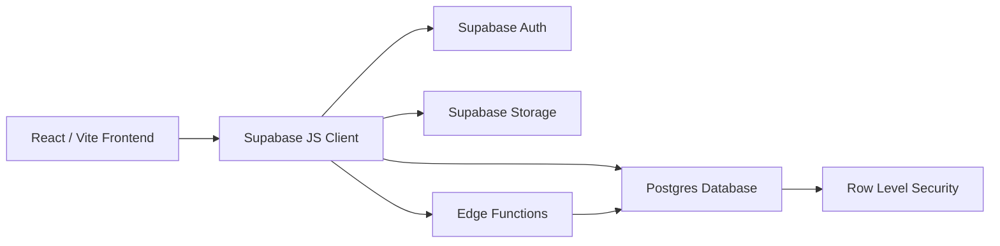

# Supabase Architecture for the Gym Subscription App

This document explains how to build the gym subscription app backend using Supabase, based on the existing product specifications in this folder. [domain-model.md](./domain-model.md), [database.md](./database.md), and [edge-functions.md](./edge-functions.md) are the detailed source of truth; this document stays the beginner-friendly overview.

> **Cancellation/refund and overlap-warning logic are deferred** in the current schema revision — see [domain-model.md §Open items](./domain-model.md#open-items-not-blocking-but-worth-resolving-before-implementation-begins). Sections below that describe that ground are marked accordingly rather than removed, so the plan for picking it back up stays visible.

---

## 1. What Supabase is

Supabase is a backend platform that gives you:

- Postgres database
- Authentication
- Storage for files/photos
- Edge Functions for server-side logic
- Row Level Security (RLS) for access control

For this app, Supabase can replace the need for a custom Node/Express backend for most normal CRUD operations.

Think of it like this:

- Frontend = React/Vite app
- Supabase = backend database + auth + storage + server logic
- Edge Functions = special backend code for sensitive rules

---

## 2. Why Supabase fits this app

Your gym subscription app needs:

- user login for admins/staff (password and Google)
- member records
- a unified, admin-managed catalog of gym plans and add-ons (membership fees, classes, couple plans, etc.)
- subscription checkouts with multiple items and quantity-based multi-period purchases
- photo storage
- business rules like plan soft-delete guards and one-time-item repeat blocking (overlap warnings and cancellation/refund are deferred for now — see the note above)
- a full field-level audit trail
- soft delete everywhere — nothing is ever permanently removed from the database

Supabase is a strong fit because it handles all of these with less setup than building a full custom backend.

---

## 3. High-level architecture



### Main components

1. Frontend
   - React app handles UI
   - Uses Supabase client SDK to read/write data

2. Supabase Auth
   - Manages login, logout, sessions, and roles
   - Supports both email/password and Google OAuth, invite-only either way

3. Postgres Database
   - Stores members, the unified plan/add-on catalog, subscriptions, subscription line items, branches, profiles, configuration, and the audit log

4. Row Level Security (RLS)
   - Protects data so only allowed users can read or change records
   - Also hides soft-deleted rows from every normal read

5. Edge Functions
   - Used for important business rules that must not be trusted from the browser

6. Storage
   - Stores photos uploaded for members

---

## 4. Recommended system design

### 4.1 Frontend layer

The frontend should stay focused on UI and user actions.

Recommended structure:

```text
frontend/src/
  components/
  pages/
  services/
  repositories/
  lib/
  context/
  types/
```

### 4.2 Backend layer in Supabase

Instead of a traditional server, the "backend" is composed of:

- database tables
- RLS policies
- auth users
- storage buckets
- edge functions

This is the architecture to use for this project.

---

## 5. Core database design

### 5.1 Tables

Full field-by-field definitions live in [domain-model.md](./domain-model.md) and the runnable SQL in [database.md](./database.md). Summary:

#### profiles
Used for app staff/admin users.

Fields: id (same as auth.users.id), full_name, role (admin/staff), is_active, created_at/changed_at, created_by/changed_by, deleted_at/deleted_by.

#### branches
Gym locations. A member's branch determines their `member_number` prefix.

Fields: id, name, code.

#### plans
Unified catalog — both gym membership packages and add-ons (e.g. "Half Year" membership, "Membership Fee", "Zumba Class") live in this one table now, distinguished by `category`.

Fields: id, name, `category` (`'membership'` or `'addon'`), `duration_days` (nullable — NULL means indefinite, e.g. a one-time fee that never expires; this single column replaces the old separate `behavior_type` field), price, `max_members` (`1` for a normal membership plan, `2` for a shared "couple" plan; only meaningful for `category = 'membership'`).

#### configuration
Generic key/value settings table, currently used to make member-number generation tunable without a migration (start sequence, increment, zero-padding width).

Fields: key, value, description.

#### members
Stores gym members (date of birth, gender, weight/height, doctor's-care flag, emergency contact, branch, system-generated member number, and more — see domain-model.md for the full list).

#### member_number_sequences
Internal counter table, one row per branch — the counter increments continuously for a branch's whole lifetime and never resets (not even at a calendar-year boundary; see [member-management.md §3](./member-management.md#3-member-number-generation-req-mem-005)). Viewable and adjustable by an admin via the Member Numbering settings screen ([frontend/screens.md WSCR-16](../frontend/screens.md#wscr-16--member-numbering)) — no longer purely internal.

#### subscriptions
A thin **header**, one row per checkout event. Fields: id, member_id, payment_mode (one value covering the whole checkout), notes. No plan, dates, quantity, or amount live here anymore — those moved to `subscription_items` below. A subscription's set of items is fixed once created.

#### subscription_items
One row per catalog item (membership **or** add-on) selected in a checkout — replaces both the old `subscriptions.plan_id`/dates/quantity/amount columns *and* the old `subscription_addons` table. Fields: id, subscription_id, plan_id, member_id, `shared_member_id` (nullable, only for a couple-plan's membership item), start_date, end_date (computed), quantity, amount_paid.

#### audit_log
Field-level change history, one row per changed field per save, fed by a database trigger on every other table.

### 5.2 Views

#### member_current_items
"What does this member currently have," across every `subscriptions` header they're part of — unions rows where the member is the checkout's `member_id` with rows where they're a couple-plan item's `shared_member_id`, filtered to `end_date is null or end_date >= current_date`. See [domain-model.md §Views](./domain-model.md#views) and [database.md §Views](./database.md#views).

---

## 6. Business rules mapped to Supabase

The product rules in [business-logic.md](./business-logic.md) should be enforced in the right layer.

### 6.1 Safe rules to enforce in the frontend only
These are UI-friendly checks and can be done in the frontend for a better experience:

- show loading states
- prefill renewal/start dates and quantity chips
- show "expiring soon" badge
- validate empty required fields (still re-validated server-side by DB constraints)

### 6.2 Rules that must be enforced in Supabase
These are security-sensitive and should not be trusted from the browser.

#### Subscription item end date
Computed server-side. Formula:

$$
end\_date = start\_date + (duration\_days \times quantity) - 1
$$

or `NULL` when the plan's `duration_days` is `NULL` (indefinite item). One formula for every `SubscriptionItem` now, membership or add-on — done inside the `create-subscription` Edge Function, once per item in the checkout.

#### One-time (indefinite) items — hard block, no override
A `category = 'addon'` item with `duration_days IS NULL` (e.g. "Membership Fee") can never be attached twice to the same member — a hard block with no bypass. Refund eligibility for these is undefined for now (see the deferred note below).

#### Plan / branch soft-delete guard
A plan (either category) or branch cannot be soft-deleted while any `subscription_items`/`members` row still references it — a "used by X record(s)" pattern, using a soft-delete `UPDATE` instead of a `DELETE`.

#### No hard delete, ever
Every business table supports soft delete only (`deleted_at`/`deleted_by`). A database trigger blocks any real `DELETE` outright, at any privilege level — see database.md §Soft Delete Enforcement.

#### Audit fields
`created_by`/`changed_by`/`deleted_by` are set by the database using the logged-in user, not by the frontend. In addition, a separate field-level trigger writes one `audit_log` row per changed column on every insert/update (see database.md).

#### Deferred: overlap warnings, cancellation & refund
Not implemented in this revision — no `overlap_override`, `status`, or `refund_amount` columns exist on `subscription_items` yet. See [domain-model.md §Open items](./domain-model.md#open-items-not-blocking-but-worth-resolving-before-implementation-begins).

---

## 7. Authentication design

Use Supabase Auth.

### Auth setup
- email/password sign-in
- Google OAuth sign-in (specified and invite-only, same as password sign-in)
- one profile row per auth user, reachable by either sign-in method interchangeably
- password reset via Supabase Auth's built-in recovery-email flow (REQ-AUTH-005); also how a Google-only user sets a password for the first time

### Invite-only rule (applies to both sign-in methods)
There is no client-side way to create a `profiles` row other than the admin-only `invite-user` Edge Function. If someone signs in with Google using an email that was never invited, the Supabase Auth handshake can still succeed, but the app must detect the missing `profiles` row immediately afterward and sign the session back out — a successful OAuth login alone never grants access to app data. See [edge-functions.md §1](./edge-functions.md#1-authentication-req-auth-001004).

### Role model
- admin: can manage users, the plan/add-on catalog, branches, and settings
- staff: can add members and create subscription checkouts

### Access control pattern
- frontend route guards for better UX
- RLS policies for real security, including hiding soft-deleted rows

This means a staff user cannot bypass restrictions just by changing the UI.

---

## 8. Row Level Security (RLS)

RLS is one of the most important parts of this architecture.

It makes sure:
- active, non-deleted users can read relevant data
- soft-deleted rows never show up in a normal read, for anyone
- admins can write the plan catalog and branches, and manage users
- staff cannot modify admin-only data
- deactivated users lose access immediately

### Example policy idea
- all active users can read members, subscriptions, subscription items, and the plan catalog (excluding soft-deleted rows)
- only admins can create/update/soft-delete plans (either category) and branches
- only admins can invite, deactivate, or soft-delete users
- only admins can read the audit log; nobody can write to it directly (only the database trigger writes to it)

RLS is the main security boundary in Supabase. See [database.md §Row Level Security](./database.md#row-level-security-rls) for the actual policies.

---

## 9. Edge Functions

Edge Functions are the place for logic that should not be exposed to the client. Full responsibilities and validation steps for each are in [edge-functions.md](./edge-functions.md) — summary below.

### Subscriptions
- **create-subscription** — verify active user, validate exactly one membership item, compute `end_date` (with quantity) per item, hard-block a repeat indefinite item, insert the header and every item together in one transaction. Overlap warnings are deferred — not part of this function in this revision.
- **update-subscription** — header-only edits (`payment_mode`, `notes`). Line items have no update path at all yet — a new checkout is required to add or change anything.

### Catalog & users
- **delete-plan / delete-branch** — usage guard, then soft-delete instead of a real delete. `delete-plan` now covers both membership and add-on rows (one unified catalog, no separate `delete-addon`).
- **invite-user** — admin-only, calls the Supabase Admin API, `profiles` row created by a trigger.
- **update-user** — admin-only profile edits (name/role/active/soft-delete), blocked against the caller's own row.

### Reporting & audit
- **get-report-data** — monthly membership/add-on item counts (split by `plans.category`) plus the itemized transaction list for a date range; read-only, available to staff too.
- Audit log reads need no Edge Function — RLS already grants admin-only `select`.

### Deferred
The old `update-subscription-secondary-member`, `cancel-subscription`, `attach-addon`, and `cancel-subscription-addon` functions have no equivalent in this revision — see [edge-functions.md](./edge-functions.md) for what's deferred and why.

These functions should use the Supabase service role internally, but the service role key should never be exposed to the frontend.

---

## 10. Storage architecture

Use a Supabase Storage bucket named something like:

- member-photos

### Flow
1. frontend compresses the photo client-side (browser canvas), producing an original and a compressed thumbnail
2. frontend uploads both to storage
3. frontend saves both public URLs (`photo_url`, `photo_thumbnail_url`) on the member record

This is better than storing binary data directly in Postgres.

---

## 11. Suggested folder structure

```text
supabase/
  migrations/
  functions/
    create-subscription/
    update-subscription/
    delete-plan/
    delete-branch/
    invite-user/
    update-user/
    get-report-data/

frontend/src/
  lib/
    supabase-client.ts
  services/
  repositories/
  context/
  pages/
  components/
  types/
```

---

## 12. Suggested frontend integration pattern

The frontend should not talk to the database directly for sensitive actions.

### Recommended pattern
- UI pages call service classes
- service classes call repository classes
- repositories talk to Supabase SDK
- sensitive writes go through Edge Functions

This keeps the app clean and makes it easier to maintain.

---

## 13. Implementation plan

### Phase 1 — Setup Supabase project
- create Supabase project
- configure auth (email/password + Google OAuth provider)
- create database tables (profiles, branches, plans, configuration, members, member_number_sequences, subscriptions, subscription_items, audit_log)
- create the `member_current_items` view
- enable RLS on every table
- create initial admin user

### Phase 2 — Core CRUD
- add branch and plan-catalog CRUD (admin-only, both membership and add-on categories)
- add members CRUD, including member-number generation
- add subscriptions/subscription-items read access

### Phase 3 — Secure business rules
- implement `create-subscription` (multi-item checkout, quantity multipliers, indefinite-item hard block)
- implement plan/branch soft-delete guards
- *(deferred)* overlap-warning flow and cancellation/refund — see domain-model.md §Open items

### Phase 4 — Access control
- add admin/staff roles
- configure RLS policies, including `deleted_at is null` filtering
- protect admin-only screens
- enforce invite-only for both password and Google sign-in

### Phase 5 — File uploads
- create storage bucket
- allow member photo uploads with client-side compression (original + thumbnail)
- save both photo URLs on the member record

### Phase 6 — Data integrity & audit
- add the `prevent_hard_delete()` trigger to every business table
- add the field-level audit trigger, grouped by `change_id`

### Phase 7 — Polish
- reports screen (monthly charts + itemized transaction list)
- expiring soon filters
- audit log overview (admin-only, read-only)
- UI feedback and error handling

---

## 14. Recommended migration order

1. Create profiles, branches, plans, configuration, members, member_number_sequences, subscriptions, subscription_items, audit_log tables
2. Add indexes
3. Add `deleted_at`/`deleted_by` columns and the `prevent_hard_delete()` triggers
4. Add `generate_member_number()` and its trigger
5. Add audit field triggers (`set_audit_fields()`) and the field-level `audit_row_changes()` trigger
6. Create the `member_current_items` view
7. Enable RLS
8. Create policies (including `deleted_at is null` filtering and the new tables)
9. Seed configuration, branches, plans (both categories)
10. Create Edge Functions
11. Connect frontend to Supabase
12. Test admin/staff permissions, including soft-delete visibility and Google OAuth invite-only behavior

See [database.md §Migrations](./database.md#migrations) for the concrete migration file list.

---

## 15. Simple mental model for beginners

If you are new to Supabase, think of it like this:

- Database = where your app data lives
- Auth = who is logged in (password or Google, same invite-only rule either way)
- Storage = where photos/files live
- RLS = who is allowed to access what, and what's hidden because it's soft-deleted
- Edge Functions = secure server-side logic
- Audit log = an automatic diary of every field that ever changed, on every table

So instead of building a full custom backend from scratch, you let Supabase handle the backend pieces for you.

---

## 16. Final recommendation

For this gym subscription app, the best approach is:

- use Supabase Auth for login (password and Google, invite-only)
- use Supabase Postgres for the main data model, with soft delete everywhere and no hard deletes
- use RLS for access control, always filtering out soft-deleted rows
- use Edge Functions for sensitive business rules (multi-item checkout creation, indefinite-item hard block, catalog guards — overlap warnings and cancellation/refund once that design lands)
- use Storage for member photos
- use the field-level audit trigger for full accountability

This will keep the app secure, scalable, and much simpler to build than a custom backend.
